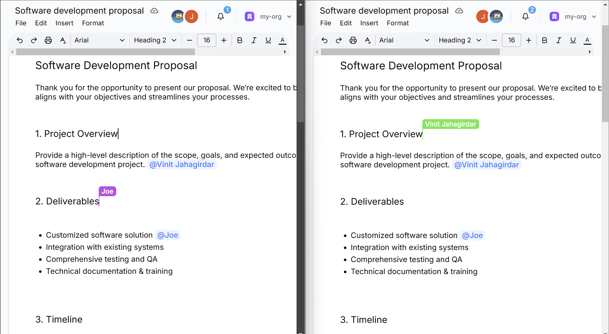

# Docs - A Collaborative Document Editor 📄

A real-time, collaborative document editor built with **Next.js 15**, **Liveblocks**, **Tiptap**, and **Convex**. This project allows multiple users to edit and manage documents together, with features like mentions, presence indicators, exporting, and custom templates.

## Features

- **Real-Time Collaboration**
  [Liveblocks](https://liveblocks.io/) to support live cursors, presence, and synchronized editing.
- **Rich Text Editing**  
  Uses [Tiptap](https://tiptap.dev/) for bold, italic, underline, tables, and more.
- **Document Management**  
  Create, rename, delete, and export documents. Includes a set of **pre-designed templates** (proposals, letters, resumes, etc.).
- **User & Organization Management**  
  Integrated with [Clerk](https://clerk.com/) to handle user accounts and organizations.

## Tech Stack

- **Framework**: [Next.js 15 (App Router)](https://nextjs.org/)
- **Real-Time**: [Liveblocks](https://liveblocks.io/)
- **Editor**: [Tiptap](https://tiptap.dev/)
- **Database/Back End**: [Convex](https://convex.dev/)
- **UI Components**: [shadcn](https://ui.shadcn.com/)

## Quick Start

1. **Clone** the repository:
   ```
   git clone https://github.com/Vinit1909/docs.git
   cd docs
   ```
2. **Install dependencies**:
   ```
   npm install
   ```
3. **Configure environment** (if needed):
   - Add your environment variables (Liveblocks, Convex, Clerk, etc.) to `.env.local`.

4. **Run locally**:
   ```
   npm run dev
   ```
5. **Build for production**:
   ```
   npm run build
   npm run start
   ```

## Live Link
Check out the live application here:  
https://docs-o-gen.vercel.app/

## Screenshots

|  |  |
|---|---|
| **Home Page**<br>[](./public/docs-home.png) | **Document Editor**<br>[](./public/docs-editor.png) |
| **Real time Colab**<br>[](./public/docs-realtime.png) | **Manage Org**<br>[](./public/docs-manageorg.png)|
